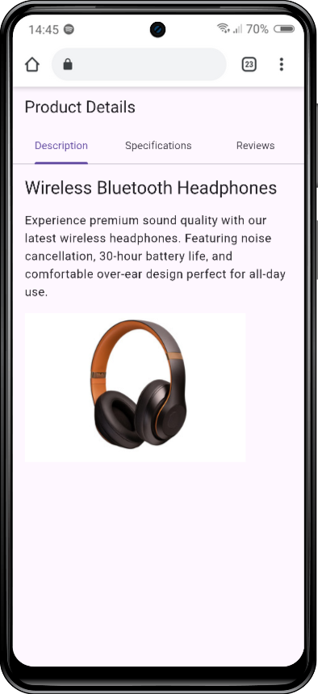

# Widget Presentation

A Flutter app demonstrating **Tab**, **TabBar**, and **TabBarView** widgets for creating tabbed navigation interfaces.

## Screenshot



## Run Instructions

```bash
# run the following comand for installing the dependencies
flutter pub get

# for the following command for running the app
flutter run
```

## Key Attribute of each Widget

### 1. **DefaultTabController - `length`**

Defines the total number of tabs. Must match the number of `Tab` widgets in `TabBar` and children in `TabBarView`.

```dart
DefaultTabController(
  length: 3,
  ...
)
```

### 2. **TabBar - `tabs`**

A list of `Tab` widgets that appear as clickable labels. Each tab corresponds to a view in `TabBarView`.

```dart
TabBar(
  tabs: [
    Tab(text: 'Description'),
    Tab(text: 'Specifications'),
    Tab(text: 'Reviews'),
  ]
)
```

### 3. **TabBarView - `children`**

A list of widgets that display the content for each tab. The order matches the `tabs` list in `TabBar`.

```dart
TabBarView(
  children: [
    DescriptionWidget(),
    SpecificationsWidget(),
    ReviewsWidget(),
  ]
)
```

## Resources

[Flutter Tabs Documentation](https://docs.flutter.dev/cookbook/design/tabs)
